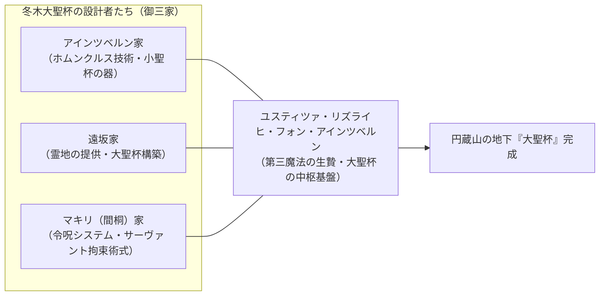
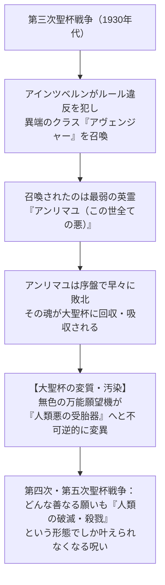

# 『Fate』シリーズ 世界観・基本設定・システム完全解説

『Fate』シリーズを深く理解するための基礎となる「魔術世界の構造」「冬木の聖杯戦争の成立」「サーヴァント召喚システム」「大聖杯汚染の真実」を体系的に解説します。

---

## 1. TYPE-MOON 魔術世界の基本概念

### 1.1 「根源の渦」と魔術師の悲願
- **根源の渦（万物の始まりにして終わり）**:
  - あらゆる事象、生命、法則、魂が流出し、還元される次元の頂点。
  - すべての魔術師の究極の目的は、この「根源」へと至る経路（ゲート）を開くことにある。
  - 根源に到達した者は万能の存在となるか、あるいは世界から消滅・昇華するとされる。

### 1.2 「魔術」と「魔法」の決定的な違い
TYPE-MOON世界において、「魔術」と「魔法」は明確に峻別されます。

| 区分 | 定義 | 現象の限界 | 代表例 |
| :--- | :--- | :--- | :--- |
| **魔術 (Magecraft)** | 時間と資金、科学技術を用いれば**現代の人間でも再現可能な事象**を、神秘の力で前倒しして起こす業。 | 人類文明の進歩とともに「できること」の神秘性は薄れ、科学に取って代わられる。 | 火を灯す、治癒を早める、身体強化、物質投影 |
| **魔法 (Magic)** | その時代の人類文明・科学技術では**いかなる手段を用いても到達・実現不可能な奇跡**。 | 根源の渦に接触した者だけが獲得する。現在は世界に5つしか存在しない。 | 第一〜第五魔法（後述） |

#### 【五つの魔法】
1. **第一魔法**: 詳細不明（無から有を生み出すエーテル塊に関わる奇跡とされる）。
2. **第二魔法（平行世界の運営）**: キシュア・ゼルレッチ・シュバインオーグが操る。並行世界への干渉・移動・エネルギー抽出。
3. **第三魔法（天の杯 / Heaven's Feel）**: **「魂の物質化」**。不老不死の獲得と、魂単体での無尽蔵なエネルギー源化。冬木の聖杯戦争の真の目的。
4. **第四魔法**: 詳細不明（秘匿されている）。
5. **第五魔法（青）**: 蒼崎青子（『魔法使いの夜』）が操る「時間の改変・熱量の前借り」。

### 1.3 世界の抑止力
世界が滅びを回避するために自動発動する防衛機構（免疫システム）。
- **霊長（人類）の抑止力（アラヤの怪物）**: 人類存続を願う無意識の集合体。「守護者（Counter Guardian）」（例: アーチャー／エミヤ）を派遣し、危機を引き起こす元凶を周囲ごと抹殺・隠滅する。
- **星（地球）の抑止力（ガイアの怪物）**: 地球そのものの生存本能。真祖（吸血鬼）や精霊を生み出す。

### 1.4 二大対立組織：魔術協会 と 聖堂教会
- **魔術協会**:
  - 魔術の秘匿と探求を目的とする世界的機関。
  - 本部であるロンドンの**「時計塔」**（十三科のロード達が治める政治と学問の府）、軍事・錬金術特化のエジプトの**「アトラス院」**、原初を残す北欧の**「彷徨海」**の三大部門からなる。
- **聖堂教会**:
  - キリスト教の異端・神秘を排斥し、奇跡の管理を行う宗教組織。
  - 吸血鬼や異端魔術師を殲滅する専門武力**「代行者（代行部隊）」**や**「埋葬機関」**を擁する。
  - 聖杯戦争においては、イエス・キリストの血を受けた聖遺物「聖杯」の名を冠する儀式を監視・管理するため、**第八秘蹟会**から「神父（監督役）」が派遣される。

---

## 2. 冬木の聖杯戦争の構造と起源

日本の地方都市「冬木市」で行われる、あらゆる願いを叶える万能の願望機「聖杯」を巡る殺し合いの儀式。しかし、その実態は**「根源への孔を開くための巨大な降霊儀式」**です。

### 2.1 始まりの御三家
1800年代初頭、第三魔法「天の杯」の再現を望む3つの魔術師家系が結託して設計しました。

1. **アインツベルン家**:
   - 元は第三魔法を行使していた魔法使いの弟子たち（ホムンクルス工房）。
   - 儀式で英霊の魂を回収・蓄積する「受容器（小聖杯）」をホムンクルスの肉体として提供（アイリスフィール、イリヤスフィールなど）。
2. **遠坂家**:
   - 日本の土着魔術師（遠坂永人）。第二魔法の使い手ゼルレッチの弟子。
   - 冬木の地脈（霊脈）の管理者として、莫大な魔力を蓄積する土地（柳洞寺のある円蔵山地下）を提供。
3. **マキリ（間桐）家**:
   - 祖はロシアから落ち延びてきたマキリ・ゾォルケン（後の間桐臓硯）。
   - 「この世の悪を根絶する」崇高な理想を持っていたが、執念の果てに蟲毒の魔術師へと変貌。
   - 英霊を縛り、絶対遵守を強いる「令呪システム」を考案。

---

## 3. サーヴァント召喚・使役システム

本来、英霊とは星の危機に際して人類を救うために召喚される最高位の使い魔（グランドクラス等）ですが、冬木のシステムではこれを**7つの「器（クラス）」**に当てはめて劣化・限定召喚しています。

### 3.1 霊基と英霊の座
- **英霊の座**: 時間軸（過去・現在・未来）の外側にある高次元データベース。伝説、神話、歴史上の英雄や、抑止力と契約した「守護者」の本体が記録されている。
- **霊基（分身）**: 冬木に召喚されるのは英霊の本体ではなく、そのデータを特定のクラスの型に流し込んだコピー（端末）。サーヴァントが死亡しても英霊の座の本体には影響しない。

### 3.2 召喚の手順と触媒
- マスター（魔術師）が魔法陣を描き、魔力と呪文を唱えて召喚する。
- **触媒（聖遺物）**: 英霊にゆかりのある品（例: アヴァロンの鞘 $\to$ アルトリア、蛇の抜け殻の化石 $\to$ ギルガメッシュ）。触媒がない場合は、マスター自身の性格・性質に波長の合う英霊が自動選定される。

### 3.3 クラス一覧

#### 【基本7クラス（三騎士＋四騎）】
| クラス名 | 役割・特性 | クラス固有能力 |
| :--- | :--- | :--- |
| **セイバー (Saber)** | 剣士。三騎士の筆頭。すべての能力が高水準でバランスに優れる最優秀クラス。 | 対魔力、騎乗 |
| **ランサー (Lancer)** | 槍兵。敏捷性と近接白兵戦能力に優れ、一撃必殺の間合いを持つ。 | 対魔力 |
| **アーチャー (Archer)** | 弓兵。強力な射撃・投擲武器を操り、単独での作戦行動が可能。 | 対魔力、単独行動 |
| **ライダー (Rider)** | 騎兵。乗り物を駆る英雄。高い機動性と強力な宝具を持つことが多い。 | 対魔力、騎乗 |
| **キャスター (Caster)** | 魔術師。神代の魔術師が多く、自前で陣地を作り魔力を調達・防衛する。 | 陣地作成、道具作成 |
| **アサシン (Assassin)** | 暗殺者。冬木の正規召喚では歴代の「ハサン・サッバーハ（山の翁）」のみ。 | 気配遮断 |
| **バーサーカー (Berserker)** | 狂戦士。召喚時に「狂化」の呪文を組み込み、理性を奪う代わりに全ステータスを爆発的に底上げしたクラス。 | 狂化 |

#### 【代表的なエクストラクラス】
- **ルーラー (Ruler)**: 聖杯大戦などの異常事態に大聖杯自身が調停役として召喚する（聖人であることが条件。令呪を各サーヴァント分保持）。
- **アヴェンジャー (Avenger)**: 復讐者。憎悪と怨念を力に変える。第三次聖杯戦争でアインツベルンが不正召喚した。
- **その他のクラス**: アルターエゴ（分霊）、フォーリナー（外宇宙の降臨者）、プリテンダー（詐術の英雄）、シールダー（盾兵）など。

### 3.4 宝具（Noble Phantasm）
英雄がその生涯で成し遂げた伝説、または愛用した武器が具現化した「切り札」。
真名（真の英雄名）を叫び、魔力を注ぎ込むことで**「真名解放」**が行われ、常識を超えた奇跡の威力を発揮します。
- **対人宝具**: ゲイ・ボルグ等（単体必殺）
- **対軍宝具**: エクスカリバー、ベレロフォン等（広範囲殲滅）
- **対城宝具**: 建物を一撃で粉砕する超火力の破壊兵器
- **対界宝具**: エヌマ・エリシュ（天地乖離す開闢の星）等（空間そのものを引き裂く）
- **結界宝具 / 固有結界**: アヴァロン、アイオニオン・ヘタイロイ、無限の剣製等

---

## 4. 令呪（Command Spells）のルール

マスターの右手に刻まれる3つの赤い紋章。マキリ（間桐）が設計した、絶対の主従契約を保証する制御機構。

1. **強制権能**:
   - 令呪を1画消費して発令した命令は、空間やサーヴァントの抵抗力を無視してほぼ絶対の強制力を持つ。
   - 「瞬時にマスターのもとへ空間転移せよ」「空間を越えて飛翔せよ」などの物理法則を超越した移動命令も可能。
   - 「自害せよ」という命令すら、高ランクの対魔力や精神抵抗がなければ逆らえない。
2. **魔力ブースト**:
   - 「宝具の威力を極大化せよ」「致命傷を修復せよ」など、莫大な純粋魔力バッテリーとして消費することも可能。
3. **喪失の帰結**:
   - 3画すべてを使い切ったマスターは、サーヴァントに対する支配権を喪失する。聖杯戦争の脱落者として教会へ保護を求める権利が生じる。

---

## 5. 大聖杯の汚染：冬木の破綻とアンリマユ

冬木の聖杯戦争がなぜ破滅的な殺戮儀式へと堕ちたのか、その核心です。

- **アンリマユ（此の世総ての悪 / Angra Mainyu）の正体**:
  - かつてゾロアスター教の村で「悪を一身に背負わされ、拷問の末に生贄にされた名もなき青年」。
  - 人々が「彼が悪であるから、我々は善でいられる」と定義したため、**「悪を願う人々の祈り」**そのものとして英霊の座に記録されてしまった。
- **汚染の結果**:
  - 本来、魂のない概念であったアンリマユに、大聖杯の莫大な魔力が注ぎ込まれ、**「実体を持った悪の赤子」**として受胎。
  - 大聖杯に接続した者は黒い泥に呑まれ、精神汚染（狂気化・反転）を起こす。
  - これが『Fate/Zero』のラストにおける冬木大火災、そして『Heaven's Feel』における「黒い影」と黒化英霊の元凶となります。

---

次章：**[02_stay_night_and_zero.md (本編軸完全網羅)](file:///z:/Fate/02_stay_night_and_zero.md)**
