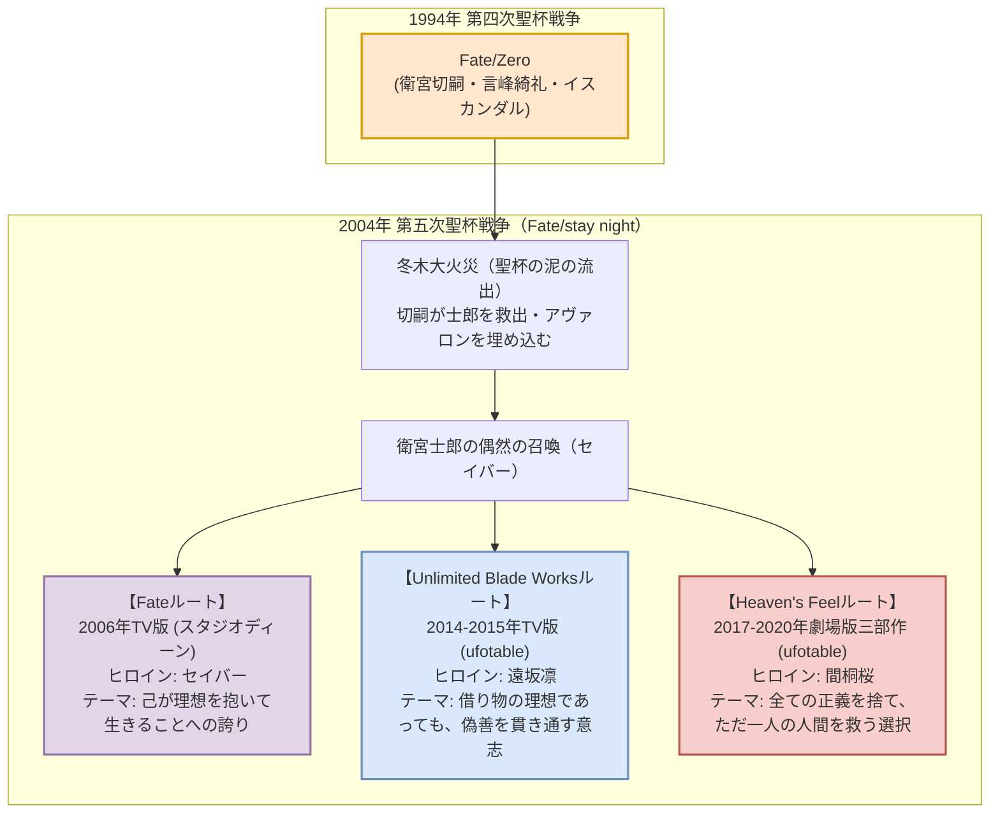

# 冬木聖杯戦争・本編軸完全網羅解説（Fate/Zero ＆ Fate/stay night）

本編軸は、1994年の第四次聖杯戦争を描く『Fate/Zero』と、その10年後（2004年）の第五次聖杯戦争を描く『Fate/stay night』の三条のルートから成り立ちます。

---

## 1. 『Fate/Zero』：悲劇の連鎖と冷徹なる謀略戦

### 1.1 作品概要・制作陣
- **放送時期**: 2011年秋（1stシーズン 全13話）、2012年春（2ndシーズン 全12話）
- **制作会社**: ufotable
- **監督**: あおきえい（『空の境界 第一章』『アルドノア・ゼロ』）
- **原作・ストーリー原案**: 虚淵玄（ニトロプラス） / TYPE-MOON
- **キャラクターデザイン**: 須藤友徳、碇谷敦
- **音楽**: 梶浦由記
- **音響監督**: 岩浪美和

### 1.2 テーマと特徴
「奇跡を求め、血で血を洗う七人の魔術師たちの生存闘争」。
少年少女の青春伝奇である『stay night』とは対照的に、大人たちによる冷徹な謀略、銃火器や爆破・心理戦を駆使した容赦ないバトルが展開されます。

### 1.3 主要7陣営相関表

| 陣営 (マスター / サーヴァント) | 特徴・戦術 | 結末 |
| :--- | :--- | :--- |
| **衛宮切嗣 × セイバー** (CV: 小山力也 / 川澄綾子) | 「魔術師殺し」の異名を持つ。騎士道を重んじるセイバーと根本的に思想が合わず、会話すら拒否。近代兵器と令呪の使い捨てで敵を葬る。 | 聖杯の本質（アンリマユの呪い）を悟り、令呪でセイバーに聖杯破壊を命じる。大火災を招き、士郎を救って余生を終える。 |
| **言峰綺礼 × アサシン** (CV: 中田譲治 / 阿部彬名 他) | 聖堂教会所属の代行者。父・璃正と師・時臣に従うふりをしていたが、内に秘めた空虚と愉悦（他者の破滅を喜ぶ本性）をギルガメッシュに開花させられる。 | 時臣を刺殺しギルガメッシュと再契約。切嗣に心臓を撃ち抜かれるが、聖杯の泥を浴びて黒い心臓を得て蘇生。 |
| **遠坂時臣 × アーチャー** (CV: 速水奨 / 関智一) | 遠坂家当主。生粋の優雅な正統派魔術師。最古の英雄王「ギルガメッシュ」を召喚するが、その傲岸不遜さに振り回される。 | 弟子の言峰綺礼に背後からアゾット剣で刺殺される。 |
| **ウェイバー × ライダー** (CV: 浪川大輔 / 大塚明夫) | 時計塔の劣等生。征服王「イスカンダル」の覇気と豪放磊落さに感化され、精神的に大きく成長する本作の真の主人公格。 | ギルガメッシュに敗北しライダーは消滅するが、ウェイバーは「王の臣下」として生き延びることを許される。 |
| **ケイネス × ランサー** (CV: 山崎たくみ / 緑川光) | 時計塔の鉱石科君主（ロード）。完璧主義のエリートだが、騎士道を貫こうとするディルムッドを疑心暗鬼から信用できず自滅へ向かう。 | 切嗣の「自己強制証文（ギアス）」の罠に嵌められ、令呪でディルムッドを自害させられた末に射殺される。 |
| **間桐雁夜 × バーサーカー** (CV: 新垣樽助 / 置鮎龍太郎) | 遠坂葵（時臣の妻）と間桐桜を救うため、自らの肉体を刻印虫に蝕まれながら参戦。召喚したのは円卓の騎士ランスロット。 | 狂気と衰弱の果てに葵を自らの手で絞殺（重傷）し、絶望の中で蟲毒の底で死亡。桜は救われず。 |
| **雨生龍之介 × キャスター** (CV: 石田彰 / 鶴岡聡) | 快楽殺人鬼コンビ。魔導書で召喚したジル・ド・レェ（青髭）と「真の神の美学」について共鳴し、冬木市で連続児童誘拐・惨殺を繰り返す。 | 未遠川で巨大海魔を召喚して大暴れした末、切嗣のスナイパーライフルで頭部を撃ち抜かれ死亡。 |

---

## 2. 『Fate/stay night』2006年TV版（スタジオディーン版）

### 2.1 作品概要
- **放送時期**: 2006年1月〜6月（全24話）
- **制作会社**: スタジオディーン
- **監督**: 山口祐司
- **音楽**: 川井憲次
- **音響監督**: 辻谷耕史

### 2.2 作品の意義と構成
- 原作ノベルゲームの第1ルート「Fate（セイバールート）」をベースにしつつ、当時1作品しか作れない前提があったため、UBWやHeaven's Feelの要素（キャスターによる他サーヴァント支配、ギルガメッシュの早期介入など）を一部折衷した独自構成。
- 衛宮士郎とセイバーの「互いに傷を抱えた少年と少女の魂の交流」が抒情的に描かれます。
- **最終回「夢の終わり」**: 聖杯を破壊し、自らの時代へ帰還したアルトリアが木漏れ日の中で永い眠りにつくシーンは、アニメ史に残る屈指の美しい名エンディングと讃えられています。

---

## 3. 『Fate/stay night [Unlimited Blade Works]』（ufotable版）

### 3.1 作品概要
- **放送時期**: 2014年秋（1stシーズン 全13話）、2015年春（2ndシーズン 全13話）
- **制作会社**: ufotable
- **監督**: 三浦貴博
- **キャラクターデザイン**: 須藤友徳、田畑壽之、碇谷敦
- **音楽**: 深澤秀行
- **音響監督**: 岩浪美和

### 3.2 テーマ：正義の味方という「理想の果て」
主人公・衛宮士郎が抱く「誰も傷つかない世界を作りたい」という願いは、冬木大火災の生存者としてのトラウマから生まれた**「借り物の理想」**でした。
本作では、その理想を突き詰めた末に守護者として永遠の殺戮を強いられ、自らの存在を消滅させたいと願う未来の自分＝**アーチャー（英霊エミヤ）**との真っ向勝負が描かれます。

### 3.3 名シークエンスと演出の革新
1. **士郎 vs アーチャー（第20話〜21話）**:
   - 互いの固有結界『無限の剣製（Unlimited Blade Works）』の中で剣を交え、哲学と信念をぶつけ合うクライマックス。
   - 「たとえ偽善であっても、誰かを救いたいと願った想いそのものは美しかった」と確信した士郎が、未来の絶望を乗り越えて剣を振るう。
2. **士郎 vs ギルガメッシュ（第24話）**:
   - 一撃必殺の宝具を無限に撃ち出すギルガメッシュに対し、士郎の固有結界が「あらかじめ無限の剣が並んでいるため、取り出し速度でギルガメッシュを上回る」というメタ的勝利を収めるカタルシス。
   - 挿入歌として流れる深澤秀行アレンジの『エミヤ（EMIYA）』は圧巻の音響設計を誇ります。

---

## 4. 劇場版『Fate/stay night [Heaven's Feel]』三部作

### 4.1 作品概要
- **公開時期**:
  - 第1章『I.presage flower』（2017年10月）
  - 第2章『II.lost butterfly』（2019年1月）
  - 第3章『III.spring song』（2020年8月）
- **制作会社**: ufotable
- **監督・絵コンテ・キャラクターデザイン**: 須藤友徳
- **脚本**: ufotable（近藤光、桧山彬）
- **音楽**: 梶浦由記
- **主題歌**: Aimer（『花の唄』『I beg you』『春はゆく』全曲・梶浦由記プロデュース）
- **音響監督**: 岩浪美和

### 4.2 テーマ：一人の少女のための「人間への転落」
- 衛宮士郎が「すべての人を救う正義の味方」という生き方を捨て、**「たとえ世界中の敵になろうとも、間桐桜だけの味方になる」**という選択（エゴ）を下す過酷な物語。
- 間桐臓硯の蟲毒、遠坂と間桐の確執、大聖杯に受胎した「此の世総ての悪（アンリマユ）」の覚醒など、冬木聖杯戦争のすべての闇と秘密が白日の下に晒されます。

### 4.3 各章の重要展開と映像・音響の到達点

#### 第1章：I.presage flower
- 日常の崩壊と、冬木市を徘徊する正体不明の「黒い影」。
- ランサー vs 真アサシン（トラック上での超高速立体チェイス）。
- セイバーが影に飲み込まれ、消息を絶つ絶望の幕引き。

#### 第2章：II.lost butterfly
- 士郎の左腕切断と、アーチャーの左腕の移植（聖骸布での封印）。腕を解けば士郎の肉体は剣に侵食される時限爆弾状態となる。
- **バーサーカー（ヘラクレス） vs セイバーオルタ**:
  - 映画館の音響装置を限界まで揺るがす重低音と超光速バトル。アニメ史に残る驚異の作画。
- 桜の狂気と暗黒化。士郎が桜を殺すナイフを振り下ろせず、「桜だけの味方になる」と抱きしめる誓い。

#### 第3章：III.spring song
- **士郎の『射殺す百頭（ナインライブス・ブレイドワークス）』**:
  - 黒化したバーサーカーを、アーチャーの左腕を解禁した士郎が一瞬の神速で投影・切断する。
- **ライダー（メドゥーサ）＆士郎 vs セイバーオルタ**:
  - ベルレフォーンとエクスカリバー・モルガンの光線激突、三次元的な縦横無尽の空間戦。
- **士郎 vs 言峰綺礼**:
  - 魔術も宝具も尽き、互いに死にかけの肉体で泥の聖杯前で行われる剥き出しのステゴロ（殴り合い）。
- **結末（トゥルーエンド）**:
  - イリヤスフィールが第三魔法を行使して小聖杯を開放・魂を物質化し、自らの命と引き換えに士郎の魂を救済。
  - 凛と桜が人形師（蒼崎橙子）の義体を手に入れ、士郎を蘇生。春の訪れとともに桜と士郎が手を繋いで歩き出す。

---

次章：**[03_fgo_anime_series.md (FGOアニメシリーズ詳細)](file:///z:/Fate/03_fgo_anime_series.md)**
