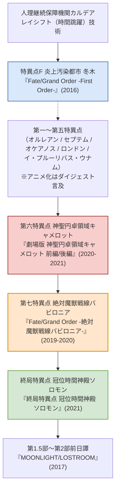

# 『Fate/Grand Order』アニメシリーズ 完全網羅解説

スマートフォン向けRPG『Fate/Grand Order（FGO）』を原作とするアニメーション作品群は、人類史が焼却された世界を取り戻す「人理修復」の壮大な旅路を描いています。

---

## 1. 『Fate/Grand Order -First Order-』：すべての始まり

### 1.1 作品概要
- **公開時期**: 2016年12月31日（長編TVスペシャル / 約74分）
- **制作会社**: Lay-duce
- **監督**: 難波日登志
- **脚本**: 関根アユミ
- **音楽**: 川﨑龍

### 1.2 あらすじ・見どころ
- 人理継続保障機関「カルデア」に一般公募で配属された少年・**藤丸立香**が、カルデア内の爆破テロに巻き込まれ、デミ・サーヴァントとして覚醒した少女・**マシュ・キリエライト**とともに、炎上する2004年の冬木（特異点F）へとレイシフト（時間跳躍）する。
- キャスターとして現れたクー・フーリンの助力を得ながら、黒化したセイバーオルタと対峙。
- 「人理焼却」を宣言する元凶・魔神柱とレフ・ライノールの宣戦布告を受け、人類最後のマスターとしての旅立ちを力強く描いた名序章。

---

## 2. 『Fate/Grand Order -絶対魔獣戦線バビロニア-』：神話の激突

### 2.1 作品概要
- **放送時期**: 2019年10月〜2020年3月（TV全21話 ＋ Episode 0）
- **制作会社**: CloverWorks
- **監督**: 赤井俊文
- **副監督**: 高雄統子
- **キャラクターデザイン**: 高瀬智章
- **音楽**: 芳賀敬太、川﨑龍
- **音響監督**: 岩浪美和

### 2.2 舞台と設定
紀元前2655年の古代メソポタミア。神と人が分かたれる最後の時代。
カルデア一行が辿り着いたウルクの地では、人類最古の英雄王**ギルガメッシュ**が過労死寸前まで政務と軍指揮を執り、魔獣の猛攻から人類を守る要塞都市「絶対魔獣戦線」を築いていた。

### 2.3 主要キャラクターと名場面
1. **ギルガメッシュ（キャスター）**:
   - 不老不死の旅から帰還し、王としての責務に命を燃やす賢王。
2. **エルキドゥ（キングゥ）**:
   - かつてのギルガメッシュの唯一無二の友の肉体を乗っ取った神造兵器の葛藤。
3. **三女神同盟**:
   - イシュタル（金星の女神・遠坂凛の依代）、エレシュキガル（冥界の女神）、ケツァル・コアトル（太陽神ルチャドール）。
4. **原初の母神・ティアマト**:
   - 人類悪の一つ「ビーストII」。黒い泥（ケイオスタイド）とラフムの群れを従え、地上すべてを生体改造・呑み込もうとする絶望の化身。
5. **「山の翁（キングハサン）」の顕現**:
   - グランドアサシンの位階を捨て、死の概念を持たない不死神ティアマトに**「死の羽音（アズライール）」**を刻みつける伝説的戦闘シーン。

### 2.4 アニメーション的特筆点
CloverWorksとWEB系若手トップアニメーター陣が集結。物理挙動の誇張と立体的なカメラワーク、手描きエフェクトの嵐が毎話劇場クオリティで展開され、現代TVアニメアクションの金字塔となりました。

---

## 3. 劇場版『神聖円卓領域キャメロット』前編 / 後編

### 3.1 作品概要
- **前編『Wandering; Agateram』**: 2020年12月公開 / 制作: Signal.MD / 監督: 末澤慧
- **後編『Paladin; Agateram』**: 2021年5月公開 / 制作: Production I.G / 監督: 荒井和人
- **キャラクターデザイン**: 細居美恵子、黄瀬和哉 ほか
- **音楽**: 芳賀敬太、深澤秀行

### 3.2 テーマ：彷徨える騎士ベディヴィエールの贖罪
舞台は西暦1273年のエルサレム。
聖剣を湖に返還できなかった自責の念から、1500年間肉体を保ちながら主を追い求めて彷徨い続けた円卓の騎士・**ベディヴィエール**（CV: 宮野真守）の視点で描かれます。

### 3.3 円卓の騎士たちの宿命
- **獅子王（アルトリア・ペンドラゴン）**:
  - 聖槍ロンゴミニアドに霊基を侵食され、感情を排した「神」となった存在。世界の滅びから「選ばれた清き魂」だけを聖槍の中に標本として永久保存しようとする。
- **円卓の騎士たちの分断**:
  - 獅子王の冷酷な虐殺命令（聖抜）に従うガウェイン、苦悶のあまり心を殺したトリスタン、自責に狂うランスロット、主の心を守ろうと孤軍奮闘するアグラヴェイン。
- **後編『Paladin』のアクション演出**:
  - 監督・荒井和人氏（デジタル作画・エフェクトの第一人者）による、ランスロットvsアグラヴェイン、ベディヴィエールvsガウェインの超高密度なエフェクトアニメーション。
  - ベディヴィエールが聖剣（アガートラム）を主へ返還し、光となって消滅する結末は涙を誘います。

---

## 4. 『Fate/Grand Order -終局特異点 冠位時間神殿ソロモン-』

### 4.1 作品概要
- **公開時期**: 2021年7月（劇場特別上映 / 約94分）
- **制作会社**: CloverWorks
- **監督**: 赤井俊文
- **音楽**: 芳賀敬太、川﨑龍

### 4.2 人理修復の最終決戦
魔術王ソロモンが座す虚数空間の神殿で、72柱の魔神柱が融合した魔神王ゲーティアと対峙。
カルデアの戦力だけでは圧倒的不利の中、第一特異点から第七特異点までで絆を結んだ**歴代サーヴァントたちが一斉に召喚され加勢に現れる**、原作屈指の激アツ展開が忠実に映像化されました。

### 4.3 ロマニ・アーキマンの選択：『アルス・ノヴァ』
- カルデアの医療部門トップとして藤丸たちを支え続けた「ドクター・ロマニ」の正体は、かつて人間になりたいと願った**本物のソロモン王**。
- ゲーティアの不死性を打ち消すため、自身の第一宝具を発動。
- **『訣別の時来たれり、其は世界を手放すもの（アルス・ノヴァ）』**:
  - ソロモンが成し遂げた偉業、授かった十の指輪、そして「英霊ソロモン」という存在そのものを神へ返還し、座の記録から永久に消滅する（二度と召喚すら不可能になる）という究極の自己犠牲。
- 残された藤丸立香が、拳一つでゲーティアと殴り合い、人理を取り戻すラストへと繋がります。

---

次章：**[04_spinoff_and_parallel.md (スピンオフ・派生世界)](file:///z:/Fate/04_spinoff_and_parallel.md)**
