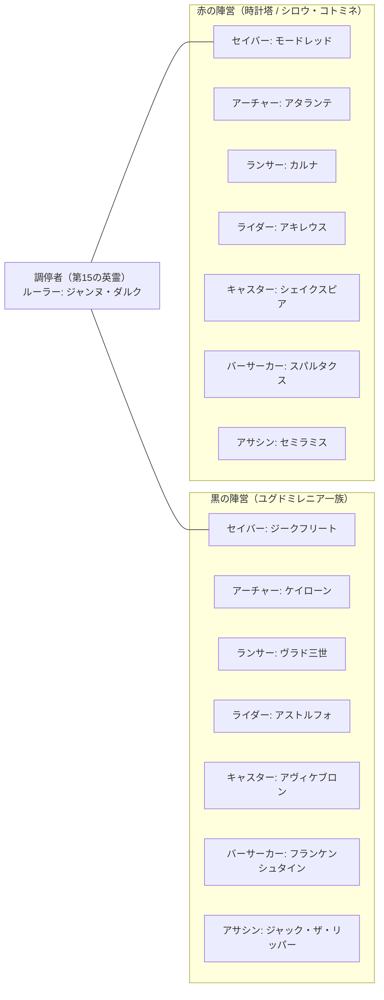
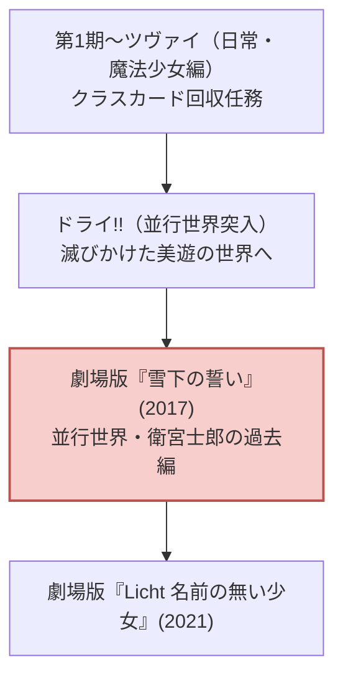

# 『Fate』スピンオフ・平行世界・派生アニメ 完全網羅解説

『Fate』の世界観は「平行世界の運営（第二魔法）」の概念により、無数の「もしも（IF）」の歴史を包括しています。本章では、代表的なスピンオフ・派生アニメ作品群を詳しく解説します。

---

## 1. 『Fate/Apocrypha』：14騎が激突する「聖杯大戦」

### 1.1 作品概要
- **放送時期**: 2017年7月〜12月（TV全25話）
- **制作会社**: A-1 Pictures
- **監督**: 浅井義之
- **シリーズ構成・原作**: 東出祐一郎
- **音楽**: 横山克
- **音響監督**: 岩浪美和

### 1.2 世界線の分岐
第三次聖杯戦争において、ナチス・ドイツの支援を受けた魔術師・ダーニックが冬木から大聖杯を強奪。ルーマニアのトゥリファスに隠匿したことで、冬木の聖杯戦争が途絶えた平行世界です。

### 1.3 「黒の陣営」vs「赤の陣営」の構造
大聖杯を保有するルーマニアの新興魔術一族「ユグドミレニア」と、それを取り戻そうとする時計塔（魔術協会）がそれぞれ7騎のサーヴァントを召喚。前代未聞の**「7対7の聖杯大戦」**が勃発します。

### 1.4 見どころと特筆点
1. **主人公・ジークとアストルフォ**:
   - ユグドミレニアの魔力供給源として使い捨てられるはずだったホムンクルスの少年「ジーク」が、ジークフリートの心臓を譲り受け、自らの意志で自由と生を求めて立ち上がる。
2. **獅子劫界離 × モードレッドのバディ**:
   - 煙草とショットガンを愛する魔術使いの賞金稼ぎ・獅子劫界離と、反逆の騎士モードレッドの小気味よい信頼関係。シリーズ屈指の人気マスター＆サーヴァント。
3. **第22話『再会と別離』のアニメーション**:
   - 若手演出家・伍柏諭氏を中心に、世界中のトップWEB系アニメーターが集結。カルナvsジーク、アキレウスvsケイローンの常識を超えた超速・荒々しい手描き作画アクションは世界中で伝説となりました。

---

## 2. 『Fate/EXTRA Last Encore』：月の電脳虚構世界

### 2.1 作品概要
- **放送時期**: 2018年1月〜3月（オブリトゥス地動説 全10話）＋ 2018年7月（イルステリアス天動説 全3話）
- **制作会社**: シャフト
- **総監督**: 新房昭之 / **シリーズディレクター**: 宮本幸裕
- **シリーズ構成**: 奈須きのこ
- **キャラクター原案**: ワダアルコ
- **音楽**: 神前暁（MONACA）

### 2.2 世界観：地上の衰退と月面SE.RA.PH
1970年代に起きた大異変により、地球上の魔力（マナ）が完全に枯渇した世界。
月に存在する超巨大霊子演算装置「ムーンセル・オートマトン」が構築した電脳仮想空間「SE.RA.PH」にて、自身の霊子体を投影した128名のマスターによるトーナメントが行われます。

### 2.3 『Last Encore』独自の構造
原作PSPゲームの直接のアニメ化ではなく、**「主人公が最後の決戦で敗北し、千年間停滞した後の世界」**を描く奈須きのこ自身による完全オリジナルシナリオ。
- 主人公・**岸浪ハクノ**は生者ではなく、かつての聖杯戦争で敗れ去った無数のマスターたちの怨嗟が集まった**「死相（デッドフェイス）」**。
- 赤セイバー（**ネロ・クラウディウス**）とともに、最下層から第7階層（チャクラ・ヴァルティン）を目指して昇降する「煉獄の旅」。
- シャフト特有のアブストラクトな幾何学美術、劇団イヌカレー空間、言葉少なに語られる難解かつ耽美な世界が構築されました。

---

## 3. 『ロード・エルメロイII世の事件簿 -魔眼蒐集列車 Grace note-』

### 3.1 作品概要
- **放送時期**: 2019年7月〜9月（TV全13話 ＋ 特別編）
- **制作会社**: TROYCA（トロイカ）
- **監督**: 加藤誠
- **原作**: 三田誠 / TYPE-MOON
- **音楽**: 梶浦由記
- **音響監督**: 岩浪美和

### 3.2 聖杯戦争の狭間を描く魔術ミステリ
第四次聖杯戦争で生き残ったウェイバー・ベルベットが、戦死した恩師ケイネスの家系を復興するため、時計塔の君主**「ロード・エルメロイII世」**を襲名。
自身の魔術師としての才能の無さを「圧倒的な観察眼と解体技術」で補い、現代ロンドンの魔術社会で起きる怪事件を論理的に解き明かしていきます。

### 3.3 魅力と設定
- **内弟子グレイ**:
  - 死神の鎌（魔術礼装アッド）を操るフードの少女。彼女の顔は、かつて冬木で召喚された「アーサー王（アルトリア）」の肉体を再現するために作られた依代であり、その顔を見ることができないエルメロイII世との繊細な師弟愛が描かれます。
- **魔眼蒐集列車（レール・ツェッペリン）**:
  - 人間の魔眼をオークションにかける幻の蒸気機関車を舞台とした本格ミステリ活劇。

---

## 4. 『Fate/strange Fake -Whispers of Dawn-』

### 4.1 作品概要
- **放送時期**: 2023年7月（長編TVスペシャル / TVシリーズ化決定）
- **制作会社**: A-1 Pictures
- **監督**: 榎戸駿、坂詰嵩仁
- **原作**: 成田良悟（『デュラララ!!』『バッカーノ!』）
- **音楽**: 澤野弘之

### 4.2 米国スノーフィールドの「偽りの聖杯戦争」
冬木の第五次聖杯戦争のデータを非合法に複製した魔術組織と合衆国政府が、ネバダ州の架空都市スノーフィールドで開始した実験。
「セイバー」の枠を欠いたまま始まったため、システムに不具合が生じ、規格外の英霊たちが次々と召喚されます。
- **ギルガメッシュ vs エルキドゥ**:
  - 開幕早々、生前の親友同士が砂漠の真ん中で「天地乖離す開闢の星（エヌマ・エリシュ）」と「人理の礎（エヌマ・エリシュ）」を最大出力で激突させる、天変地異のオープニング。
- 澤野弘之氏による重厚なシンフォニック・ロック劇伴と、ハイエンドな作画で大きな話題を呼びました。

---

## 5. 『Fate/kaleid liner プリズマ☆イリヤ』シリーズ

### 5.1 作品概要
- **制作会社**: SILVER LINK.
- **監督**: 大沼心、神保昌登、高橋賢
- **シリーズ構成**: 井上堅二、水瀬葉月
- **原作**: ひろやまひろし

### 5.2 魔法少女スピンオフから並行世界の死闘へ
「もしも切嗣とアイリスフィールが冬木の大聖杯を解体し、聖杯戦争が起きなかったら」という平和な世界で暮らす小学5年生のイリヤスフィールが主人公。

- **劇場版『雪下の誓い』の衝撃**:
  - 神の生贄として生まれた少女・美遊（サカツキミユ）を救うため、並行世界の衛宮士郎が「正義の味方」という生き方を捨て、全英霊のクラスカードを一人で打ち倒していく修羅の戦いを描く。
  - 本編『Heaven's Feel』の士郎の決断と深く共鳴し、ファンから絶賛されました。

---

## 6. コメディ・日常系作品

### 6.1 『衛宮さんちの今日のごはん』
- **公開**: 2018年（Web配信 全13話） / 制作: ufotable
- **内容**: 「冬木の誰も傷つかない、誰も死なない世界」。衛宮士郎が旬の食材を使って美味しい料理を作り、セイバーや凛、桜、ライダー、ランサー、イリヤ、言峰綺礼までもが食卓を囲むハートフル料理アニメ。ufotableの繊細な日常作画・料理描写が光ります。

### 6.2 『Carnival Phantasm（カーニバル・ファンタズム）』
- **公開**: 2011年（OVA 全12話＋EX） / 制作: Lerche / 監督: 岸誠二
- **内容**: TYPE-MOON10周年記念作品。『月姫』と『Fate』のキャラクターたちが一堂に会し、理不尽なクイズ番組や白熱の聖杯グランプリ（レース）を繰り広げる究極の公式パロディアニメ。

---

次章：**[05_sound_and_production.md (音響・劇伴音楽・映像美学 特集)](file:///z:/Fate/05_sound_and_production.md)**
