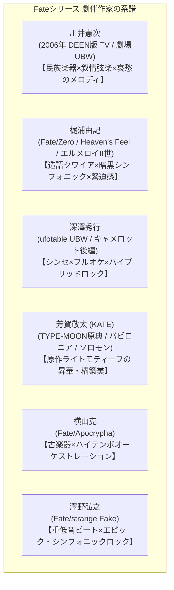
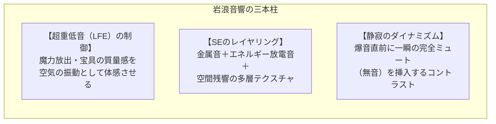

# 『Fate』シリーズ 映像美学・劇伴音楽・音響演出 徹底分析

『Fate』シリーズが世界的な支持を獲得した最大の要因の一つに、**「映像美学」「劇伴音楽」「音響デザイン（SE・サラウンド設計）」の三位一体となった超高精度な演出設計**があります。
本章では、プロのサウンドデザイナー・音響制作者の視点からも興味深い、制作スタジオの技術的特徴、作曲家ごとの音楽論、そして音響監督による空間・効果音（SE）演出を詳細に分析します。

---

## 1. 劇伴音楽の系譜：作曲家別のアプローチと音楽理論

『Fate』シリーズの劇伴は、時代や作品のテーマに応じて日本を代表するトップコンポーザーたちが手掛けてきました。各作家の音楽的シグネチャーと音響空間の作り方を比較します。

### 1.1 川井憲次：叙情性と哀愁のメロディック・アプローチ
- **担当作**: 『Fate/stay night』TV版（2006年）、劇場版『Fate/stay night UNLIMITED BLADE WORKS』（2010年）
- **音楽的特徴**:
  - **メロディの強さ**: 聴くだけで特定のシーンや感情が蘇る、強力な主旋律（リード）の構築。
  - **楽器編成**: 生のストリングス・チェロの哀切な旋律に、タブラやダルブッカ等のエスニックパーカッション、静謐なシンセパッドを重ねる「川井節」。
  - **代表曲**:
    - 『運命の夜（Unmei no Yoru）』: アルペジオのピアノと壮大なストリングスが重なり合う、Fate史上の金字塔。
    - 『約束された勝利の剣』: 神聖でありながら重い宿命を背負ったアルトリアの騎士道を象徴する叙事詩的ファンファーレ。
  - **音響的効果**: 2006年版の「少年と少女の切ないボーイ・ミーツ・ガール」という情緒的トーンを完璧に決定づけました。

### 1.2 梶浦由記：暗黒幻想とフィルムスコアリングの極致
- **担当作**: 『Fate/Zero』、劇場版『Heaven's Feel』三部作、『ロード・エルメロイII世の事件簿』
- **音楽的特徴**:
  - **「梶浦語」クワイア（造語コーラス）**: 意味を持たない音素による多重合唱を用いることで、聴く者の言語野を刺激せず、ダイレクトに原初的な畏怖・神聖さを喚起する。
  - **弦楽のソリタリーな緊張感**: 独奏バイオリンやチェロが奏でる不安定な旋律、ピチカート、不協和音によるサイコサスペンスの醸成。
  - **完全フィルムスコアリング（Heaven's Feel）**:
    - 既成曲をシーンに当てるのではなく、完成した映像のフレーム単位（秒数・コンマ秒）に合わせて楽曲を書き下ろす「フィルムスコアリング」を採用。
    - キャラクターの歩幅、視線の移動、ナイフを構える瞬間に合わせて音楽のテンポや拍子が変化する緻密な設計。
  - **主題歌との有機的連携**: Aimerが歌う劇場版HF三部作の主題歌（『花の唄』『I beg you』『春はゆく』）を梶浦氏自身が作詞・作曲・プロデュース。劇伴の旋律（モチーフ）が主題歌のサビやイントロと密接にリンクする構造となっています。

### 1.3 深澤秀行：シンセサイザーとシンフォニックのハイブリッド
- **担当作**: 『Fate/stay night [Unlimited Blade Works]』TV版（2014-2015年）、劇場版『キャメロット後編』
- **音楽的特徴**:
  - **エレクトロニックとオーケストラの融合**: 重厚なブラスセクションの背後に、アナログモデリングシンセのモジュレーションや、歪ませたアシッドベース、重厚なキックドラムを配置。
  - **『EMIYA』アレンジの進化**:
    - PCゲーム原曲（芳賀敬太作曲）のメロディラインを尊重しつつ、現代的なEDM・プログレッシブロックの手法を取り入れ、BPMを上げ、ブラスとディストーションギターが呼応する戦闘曲へと昇華。
  - **静と動のコントラスト**: 日常シーンのアンビエントなエレクトロニカから、固有結界展開時の大爆発へのダイナミックレンジの広さが特徴です。

---

## 2. 音響監督・岩浪美和のサウンドデザイン思想

ufotable作品をはじめ、多くのFateアニメ（『Zero』『UBW』『HF』『Apocrypha』『バビロニア』）で音響監督を務める**岩浪美和 氏**のサウンド演出は、業界内で極めて高い評価を受けています。

### 2.1 重低音（LFEチャンネル / サブウーファー）の革新的活用
- 通常のTVアニメでは敬遠されがちな超低域（40Hz〜80Hz以下）を、宝具の発動や魔力衝突の瞬間に大胆にブースト。
- 『Heaven's Feel』第2章の「バーサーカー vs セイバーオルタ」戦では、映画館の床や空気が物理的に震えるほどの音響エネルギーを設計。
- 劇場上映においては、通常の上映館に加えて自身で音響調整を行う**「極上爆音上映」「轟音上映」「Dolby Atmos」**を展開し、音響そのものをエンターテインメントの主役に引き上げました。

### 2.2 効果音（SE）の多層レイヤリング
- **サーヴァントの剣撃音**:
  - 単なる「刀剣がぶつかる金属音（チャンバラ音）」ではなく、**「純粋な魔力の塊が弾け飛ぶ高周波シンセ音」＋「衝撃波の重低音」＋「金属のしなり音」**を多重レイヤー化。
- **足音と気配**:
  - アサシンの「気配遮断」が解ける瞬間や、黒い影が這い寄る瞬間に、微小な粘液音や微細なホワイトノイズを配置し、視覚以上の生理的嫌悪感・恐怖を演出。

### 2.3 「無音（Silence）」による演出
- 最大の音量を際立たせるために、インパクトの直前コンマ数秒間、劇伴・環境音・セリフをすべて断ち切る**「完全な無音」**を挟み込みます。この瞬間的な減圧が、その後の大爆発の体感音圧を何倍にも跳ね上げます。

---

## 3. 制作スタジオ別の映像美学と撮影処理

### 3.1 ufotable：デジタル映像部による「作画×CG×撮影」の一体化
- **通常のアニメ制作**: 原画・動画 $\to$ 色指定・ペイント $\to$ 背景美術 $\to$ 撮影・特効 という分業制。
- **ufotableの強み**:
  - 社内に強力な「デジタル映像部（3DCG・撮影）」を常設し、絵コンテ段階から撮影処理（光の陰影、レンズフレア、空気感）を逆算して作画。
  - **被写界深度（DoF）とボケ味**: 実写シネマ用のアナモフィックレンズで撮影したかのような、美しいボケと色収差の適用。
  - **手描きと3Dのシームレスな融合**: 宝具の幾何学的軌道やエフェクト（鎖、炎、光の粒子）を3D空間に配置し、手描きの躍動感と完璧に同期させています。

### 3.2 CloverWorks（バビロニア）：WEB系アクション作画の躍動
- 若手トップアニメーター（温泉中也氏、Moaang氏、伍柏諭氏ら）を積極起用。
- リアルな解剖学的骨格描写よりも、**「スピード感のためのパース崩し（誇張）」「手描きのデフォルメエフェクト（オバケ、破片の形状）」「ダイナミックなカメラの回り込み」**を重視し、神話級のスケール感をフレッシュに表現。

### 3.3 シャフト（EXTRA Last Encore）：アブストラクトな記号的空間
- 実写的なリアリズムとは対極にある、幾何学的パターン、極端な俯瞰・アオリ、明暗の強いコントラスト。
- 「千年の停滞」という舞台設定を、冷徹なタイポグラフィと劇団イヌカレーの異質なコラージュ美術で表現しました。

---

## 4. 主題歌の軌跡と劇中演出の融合

『Fate』シリーズのボーカル楽曲は、単なるタイアップ曲ではなく、**物語のテーマソング（キャラクターの心情そのもの）**として機能しています。

| アーティスト | 楽曲例 | 作品 | 演出上の特徴 |
| :--- | :--- | :--- | :--- |
| **タイナカサチ** | 『disillusion』 『きらめく涙は星に』 | 2006年 TV版 | 原作PC版主題歌『THIS ILLUSION』の正統アレンジ。透明感あるハイトーンで士郎とセイバーの純愛を象徴。 |
| **LiSA** | 『oath sign』 『ASH』 | 『Fate/Zero』 『Apocrypha』 | 切嗣やジャンヌの「信念と誓い」を疾走感あるストリングス・ロックで力強く牽引。 |
| **Kalafina** | 『to the beginning』 『満天』『believe』 | 『Fate/Zero』 『UBW』 | 梶浦由記プロデュースの三声コーラス。運命の過酷さと祈りを重厚なコーラスワークで昇華。 |
| **Aimer** | 『Brave Shine』 『LAST STARDUST』 『花の唄』『I beg you』『春はゆく』 | 『UBW』 『Heaven's Feel』 | ハスキーで情感に満ちた唯一無二の歌声。『LAST STARDUST』はUBW第20話の士郎vsアーチャーのクライマックス挿入歌として、セリフと歌詞が完全に重なり合う奇跡の演出を生んだ。 |
| **EGOIST** | 『英雄 運命の詩』 | 『Apocrypha』 | ryo (supercell) のプロデュースによる劇的で攻撃的なエレクトロニック・シンフォニー。 |

---

## 5. まとめ：アニメ『Fate』が提示したメディアミックスの完成形

アニメ『Fate』シリーズが20年にわたり最高峰のクオリティを維持し続けている理由は、原作ゲームの持つ重厚なテキストと設定をそのままなぞるのではなく、**「アニメーションという映像・音響メディアだからこそ表現できる空間芸術」へと常に再構築し続けてきた点**にあります。

- 緻密な世界観設定（魔術・令呪・英霊）
- 作画とデジタル撮影技術の極限の追求
- 作曲家と音響監督による妥協のないサウンドデザイン

これらが有機的に噛み合うことで、単なるアクションアニメを超えた、映画的・オペラ的な感動を生み出し続けています。

---

全編：
- **[README.md (総合目次＆視聴ガイド)](file:///z:/Fate/README.md)**
- **[01_worldview_and_rules.md (世界観・システム解説)](file:///z:/Fate/01_worldview_and_rules.md)**
- **[02_stay_night_and_zero.md (本編軸完全網羅)](file:///z:/Fate/02_stay_night_and_zero.md)**
- **[03_fgo_anime_series.md (FGOアニメシリーズ詳細)](file:///z:/Fate/03_fgo_anime_series.md)**
- **[04_spinoff_and_parallel.md (スピンオフ・派生世界)](file:///z:/Fate/04_spinoff_and_parallel.md)**
- **[05_sound_and_production.md (音響・劇伴音楽・映像美学 特集)](file:///z:/Fate/05_sound_and_production.md)**
