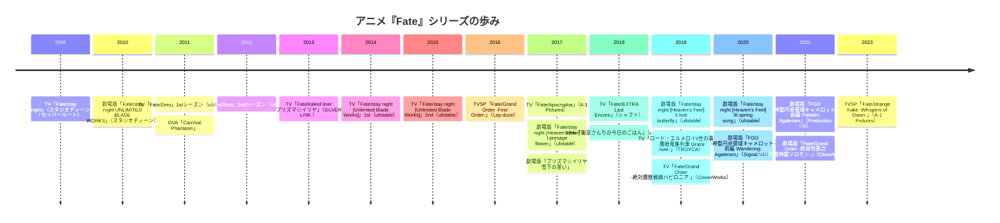
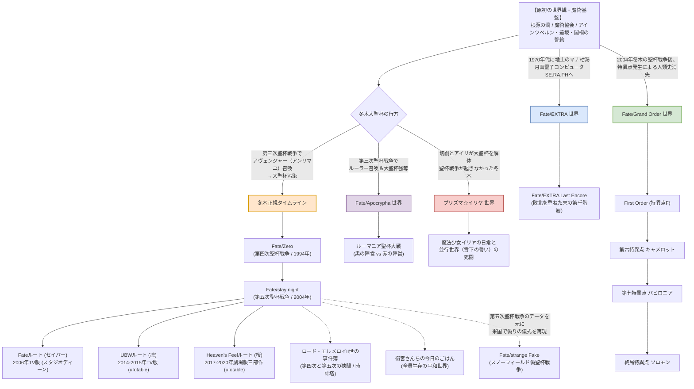

# アニメ『Fate』シリーズ 徹底詳細ポータル＆視聴完全ガイド

本書は、TYPE-MOON原作の伝奇活劇『Fate』シリーズのアニメ化作品群について、世界観・歴史・作品詳細・音響演出・視聴順を網羅した総合資料ポータルです。

---

## 1. 資料ドキュメント構成

本資料群は以下の6編で構成されています。目的に応じて各ドキュメントをご参照ください。

| ファイル | タイトル | 主な収録内容 |
| :--- | :--- | :--- |
| **[README.md](file:///z:/Fate/README.md)** | **総合目次＆視聴ガイド** | シリーズ全体像、世界線マップ、おすすめ視聴ルート |
| **[01_worldview_and_rules.md](file:///z:/Fate/01_worldview_and_rules.md)** | **世界観・システム解説** | 根源の渦、魔術協会、冬木の聖杯戦争システム、令呪、サーヴァント構造 |
| **[02_stay_night_and_zero.md](file:///z:/Fate/02_stay_night_and_zero.md)** | **本編軸（stay night / Zero）** | DEEN版、ufotable版UBW、Heaven's Feel三部作、Fate/Zeroの詳細解説 |
| **[03_fgo_anime_series.md](file:///z:/Fate/03_fgo_anime_series.md)** | **Fate/Grand Order アニメ群** | First Order、バビロニア、キャメロット、ソロモン等の人理修復叙事詩 |
| **[04_spinoff_and_parallel.md](file:///z:/Fate/04_spinoff_and_parallel.md)** | **スピンオフ・平行世界** | Apocrypha、EXTRA Last Encore、Strange Fake、エルメロイII世、プリヤ、日常系 |
| **[05_sound_and_production.md](file:///z:/Fate/05_sound_and_production.md)** | **映像演出・音響・劇伴音楽分析** | 川井憲次／梶浦由記／深澤秀行の劇伴論、岩浪美和の音響設計、SE美学 |
| **[ubw_episode_00.md](file:///z:/Fate/ubw_episode_00.md)** | **UBW #00 プロローグ詳細解剖** | 遠坂凛視点による初回SPの構成、ランサー戦、蘇生の伏線、音響・SE設計 |

---

## 2. アニメ『Fate』シリーズ 展開年表

---

## 3. 世界線・平行世界マップ

『Fate』シリーズは「平行世界（マルチバース）」の概念を公式に採用しており、根源的な設定を共有しつつ、歴史の分岐点によって様々な世界が存在します。

---

## 4. 目的別おすすめ視聴ルート

『Fate』シリーズは「どこから見ればいいのか」が最も議論される作品群の一つです。鑑賞目的に応じて以下の3つのアプローチを推奨します。

### ルートA：王道・物語理解重視ルート（初心者推奨）
最も世界観と物語のドラマ性を無理なく理解できる標準コースです。

1. **『Fate/stay night [Unlimited Blade Works]』**（ufotable TV版全25話＋#00）
   - **理由**: 現代最高峰の作画クオリティと丁寧な世界観説明（魔術、令呪、英霊）があり、主人公・衛宮士郎の生き様が最もストレートに描かれます。
2. **『Fate/Zero』**（ufotable TV版全25話）
   - **理由**: UBWで語られた「10年前の真実（第四次聖杯戦争）」の全貌が明かされます。UBW視聴後であれば、結末の過酷さや各キャラクターの因縁を100%味わえます。
3. **『Fate/stay night [Heaven's Feel]』**（ufotable 劇場版全3章）
   - **理由**: 本編三部作の最終ルートであり、冬木の聖杯戦争の暗部・根源のすべてを暴く集大成。劇場アニメーションとしての映像・音響密度は国内最高水準です。
4. **『Fate/stay night』2006年版**（スタジオディーン TV版全24話 / 任意）
   - **理由**: 原作の第1ルート「Fate（セイバールート）」を描いた唯一のTVアニメ。川井憲次氏の劇伴やセイバーとの情感溢れるボーイ・ミーツ・ガールを補完できます。

---

### ルートB：公開順・歴史追体験ルート
ファンが当時歩んだ歴史そのものを追体験するルートです。映像技術の進化と作劇の変遷をリアルに体感できます。

`DEEN版 stay night (2006)` $\to$ `Fate/Zero (2011-2012)` $\to$ `ufotable UBW (2014-2015)` $\to$ `Heaven's Feel 三部作 (2017-2020)` $\to$ 各種スピンオフ

---

### ルートC：ゲーム（FGO）プレイヤー向け直行ルート
スマートフォン向けRPG『Fate/Grand Order』をプレイしている、あるいはFGOのアニメに興味がある方向けのルートです。

1. **『Fate/Grand Order -First Order-』**（長編TVSP）
   - 原作ゲームのチュートリアル「特異点F 炎上汚染都市 冬木」を完全映像化。カルデアの基礎設定を把握。
2. **『Fate/Grand Order -絶対魔獣戦線バビロニア-』**（TV全21話）
   - 神代のメソポタミアを舞台に、ギルガメッシュ王とカルデア一行がティアマト神に挑む最高峰のアクション大作。
3. **『劇場版 Fate/Grand Order -神聖円卓領域キャメロット-（前編・後編）』**
   - 彷徨う騎士ベディヴィエールと獅子王（アルトリア）率いる円卓の騎士の哀しき激突。
4. **『Fate/Grand Order -終局特異点 冠位時間神殿ソロモン-』**（劇場版）
   - 第1部クライマックス。全サーヴァントの集結とドクター・ロマンの真実。

---

### ルートD：サウンド・音響演出探求ルート
川井憲次、梶浦由記、深澤秀行の音響空間構築や、岩浪美和音響監督の重低音・サラウンド設計を堪能するルートです。

1. **『Fate/stay night』2006年版**: 川井憲次氏によるエスニック弦楽器とオーケストラの哀愁、メロディックなテーマ性の極致。
2. **『Fate/Zero』**: 梶浦由記氏によるダークファンタジー劇伴（クワイア、緊迫の弦楽四重奏）。
3. **『Fate/stay night [UBW]』**: 深澤秀行氏のシンセサイザーとシンフォニックの融合、スピード感とデジタルハイブリッド。
4. **『Fate/stay night [Heaven's Feel]』**: 梶浦由記氏×岩浪美和音響監督の集大成。劇場サラウンド（5.1ch/Dolby Atmos）、重低音の衝撃波、暗黒オペラ的劇伴。

---

次章：**[01_worldview_and_rules.md (世界観・システム解説)](file:///z:/Fate/01_worldview_and_rules.md)**
