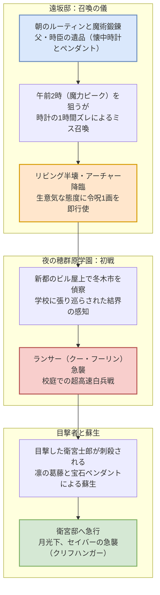

# 『Fate/stay night [UBW]』#00「プロローグ」詳細解説＆音響分析

ufotable版『Fate/stay night [Unlimited Blade Works]』のプロローグとして制作された、遠坂凛視点による初回1時間スペシャルの徹底解剖レポートです。

---

## 1. エピソード基本情報

| 項目 | データ |
| :--- | :--- |
| **サブタイトル** | #00 プロローグ（Prologue） |
| **放送形態** | 初回1時間スペシャル（約48分） |
| **視点人物** | 遠坂凛（CV: 植田佳奈） |
| **絵コンテ・演出** | 三浦貴博（監督） |
| **キャラクターデザイン・総作画監督** | 須藤友徳、碇谷敦 |
| **音楽** | 深澤秀行 |
| **音響監督** | 岩浪美和 |

---

## 2. 物語の構成と対比構造

本作は、**「#00（遠坂凛視点）」**と**「#01（衛宮士郎視点）」**で**同じ数日間の出来事を表と裏から描く**という、原作ノベルゲームの多重視点構造をアニメーションとして完璧に昇華したエピソードです。

---

## 3. 主要シークエンスの演出解剖

### 3.1 遠坂凛の日常と「完璧主義ゆえの隙」
- **日常の緻密な描写**:
  - 朝の身支度、紅茶の淹れ方、魔術師としての規律正しい所作を丁寧に積み重ねることで、凛が背負っている「名門・遠坂家の後継者」としてのプレッシャーを観客に印象付けます。
- **時計の1時間ズレ**:
  - 亡き父・時臣の形見の懐中時計が1時間進んでいたため、午前1時に儀式を行ってしまうという凡ミス。
  - 「優秀でありながらここ一番で致命的なうっかりをやらかす」という遠坂家の血統的キャラクター性が、重厚な伝奇サスペンスの中で絶妙なユーモアと親しみやすさを生み出しています。

### 3.2 アーチャーの召喚と主従関係の確立
- **瓦礫の上の赤い騎士**:
  - 完璧な陣を描いたはずが、リビングの天井を突き破って現れたのは正体不明の弓兵。
  - 「自分がマスターとして未熟だからセイバーを呼べなかったのか」と落胆する凛と、「こんな小娘が自分のマスターか」と見下すアーチャー。
- **令呪1画の即時消費**:
  - 生意気なアーチャーに対し、凛はためらうことなく**「私の言うことに絶対服従しろ」と令呪を行使**。
  - この命令自体は漠然としすぎており完全な強制力には至りませんが、「不可視の重圧」としてアーチャーの霊基を軋ませ、「このマスターは本気で自分を律する覚悟がある」と認めさせる決定打となります。

### 3.3 穂群原学園の夜戦：ランサー vs アーチャー
- **校庭・校舎を利用した三次元アクション**:
  - 三浦貴博監督特有の、パースを大胆に崩した広角カメラワーク。
  - 槍の間合いを弓兵が双剣（干将・莫耶）で捌くという、常識外れの白兵戦。
  - 体育館の屋根、校舎の壁面、グラウンドを縦横無尽に駆ける立体的な殺陣が展開されます。

### 3.4 衛宮士郎の刺殺と、凛のペンダントによる蘇生
- **魔術師の掟 vs 人間性**:
  - 戦いを目撃した無関係の生徒（士郎）をランサーが掟通りに刺殺。
  - 冷徹な魔術師であれば放置すべき局面で、凛は「桜が気にかけている相手」であることに気づき激しく動揺します。
  - 亡き父の形見であり、一生に一度しか使えない莫大な魔力を秘めた**「宝石のペンダント」の全魔力を躊躇なく注ぎ込み、士郎の心臓を修復・蘇生**させます。
  - ※このペンダントは、物語後半における「アーチャーの真名」に直結するシリーズ最大の伏線の一つです。

---

## 4. 音響・劇伴（サウンドデザイン）の深層解剖

サウンドデザイナー・音響制作者の視点から、本作の音響設計（作曲: 深澤秀行 氏 / 音響監督: 岩浪美和 氏）を分析します。

### 4.1 召喚シークエンスのダイナミックレンジ
- **静寂（無音）のコントラスト**:
  - 凛の詠唱が最高潮に達し、リビングが爆発する直前、**コンマ数秒の完全なミュート（無音）**が挿入されます。
  - この減圧によって、直後の爆発音と破片散乱音の体感音圧が最大化されます。
- **低周波（LFE）の這わせ方**:
  - アーチャーが煙の中から姿を現す際、**30Hz〜60Hzの重いサブベース音**が鳴り響き、英霊が受肉・現界したことによる空気の圧縮感を体感させます。

### 4.2 効果音（SE）の多重テクスチャ
- **ランサーの槍（ゲイ・ボルグ）**:
  - 単なる「ヒュン」という風切り音ではなく、**高周波のジェットエンジン風ノイズ＋鋭利な風圧音**がレイヤリングされており、音だけで槍の音速突破が伝わります。
- **干将・莫耶の白兵戦**:
  - 金属同士の衝突音（Clang）に、魔力刃が擦れ合う「ジュッ」「バチッ」という放電テクスチャが混ざり、単なる鉄の武器ではない「神秘を帯びた宝具」の質量を表現。

### 4.3 蘇生シーンの微小音響（Micro-acoustics）
- **ローパスフィルターを通した心拍音**:
  - 廊下に倒れた士郎を発見した際、周囲の環境音やBGMが一気にフェードアウトし、**「止まりかけの重い心拍音（ドクン……ドクン……）」**だけが耳に残る設計。
- **ペンダントの魔力奔流**:
  - 宝石が砕け散るクリスタル音とともに、血管を魔力が駆け巡るリバースシンセ音が鳴り、死から生への反転を劇的に聴覚化しています。

---

## 5. 次回（#01）との連動ポイント

次回**#01「冬の日、運命の夜」**は、全く同じ時間軸を**「衛宮士郎の視点」**から描きます。

- 凛が校庭でアーチャーと戦っていた時、士郎は学校の弓道場で何をしていたのか？
- 校舎の窓から見た「怪物たちの戦い」の理不尽な恐怖。
- 心臓を貫かれ、なぜ自分が生きているのか分からない士郎の混乱（誰が助けてくれたのか知らない）。
- そして、自宅に追撃してきたランサーに追い詰められ、土蔵で**「問おう、貴方が私のマスターか」**とセイバーに出会う奇跡の瞬間。

#00と#01が合わさることで、物語のパズルが美しく完成します。
